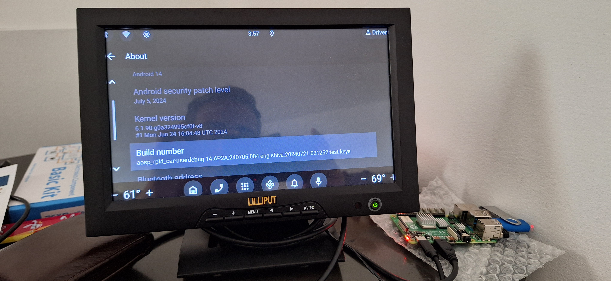

###
# Building Automotive Anadoid 14 OS for Raspberry PI using Docker
###

This readme helps you to build the Android Automotive OS for Raspberry PI on ubuntu using own Docker container. And will help you run on Raspberry PI4B. 

## Prerequisites

    Ubuntu 22.04 LTS build machine(32 GB RAM + 32GB swap space)
    Raspberry PI 4B
    SD Card/USB drive
    Monitor
    Micro HDMI
    

Lets see how to achieve it.

1.  Installing Docker
2.  Building a Docker image
3.  Running a container
4.  Building Automotive Android 14 OS
5.  Create images for Raspberry PI

## 1. Installing Docker on Ubuntu
Follow the docker website  https://docs.docker.com/engine/install/ubuntu/ for installing the docker on ubuntu.

### Install using the apt repository

Before you install Docker Engine for the first time on a new host machine, you need to set up the Docker repository. Afterward, you can install and update Docker from the repository.

### Set up Docker's apt repository.
```
# Add Docker's official GPG key:
sudo apt-get update
sudo apt-get install ca-certificates curl
sudo install -m 0755 -d /etc/apt/keyrings
sudo curl -fsSL https://download.docker.com/linux/ubuntu/gpg -o /etc/apt/keyrings/docker.asc
sudo chmod a+r /etc/apt/keyrings/docker.asc

# Add the repository to Apt sources:
echo \
  "deb [arch=$(dpkg --print-architecture) signed-by=/etc/apt/keyrings/docker.asc] https://download.docker.com/linux/ubuntu \
  $(. /etc/os-release && echo "$VERSION_CODENAME") stable" | \
  sudo tee /etc/apt/sources.list.d/docker.list > /dev/null
sudo apt-get update

```

### Install the Docker packages

To install the latest version, run:

```
sudo apt-get install docker-ce docker-ce-cli containerd.io docker-buildx-plugin docker-compose-plugin
```

### Verify Docker enginee installation
Verify that the Docker Engine installation is successful by running the hello-world image.

```
sudo docker run hello-world
```

After successful installation of docker, the docker will show the below response.


## 2. Building a Docker image 

Use the Dockerfile script to create the docker image which can be used to build  Automotive Android OS 14
        
1.  Install required dependencies 
2.  Creating root non-root user and group
3.  Copying required files 

### Install required dependencies
  To install the required build essentials and tools the Dockerfile is used. 
  
  To overcome entering the inputs while docker image is getting prepared a non interactive method is used and that can be done by using the following environment in dockerfile

  ```
  FROM ubuntu:22.04

  ENV DEBIAN_FRONTEND=noninteractive
  ```

Please go through the Android https://source.android.com/docs/setup/start/requirements website setup guide to understand about the tools required to build source code and install them. Example code snippet is as shown below

```
RUN apt-get install -y gnupg flex bison build-essential \
	zip zlib1g-dev libc6-dev-i386 x11proto-core-dev \
	libx11-dev lib32z1-dev libgl1-mesa-dev libxml2-utils \
	xsltproc fontconfig
```

### Creating root non root user and group
  To use the docker container as root and non root user, create, add user and group as shown below

  ```
  #ADD sudo to the user and set $USER_NAME as password for sudo
  RUN groupadd -g $HOST_GID $USER_NAME && \
      useradd -g $HOST_GID -m -s /bin/bash -u $HOST_UID $USER_NAME && \
      echo "$USER_NAME:$USER_NAME" | chpasswd && adduser $USER_NAME sudo
  ```

Here the $USER_NAME is passowrd for the sudo.

#### Copying required files
  Create the required directories and file while creating the docker image.

```
ENV USER_FOLDER /home/$USER_NAME
```

The environment variable $USER_FOLDER is available by default when the docker container is launched.

### Building docker image

To build the own docker image as 
```
docker build -t <image-name> .
```

To build the own docker a set of arguments can also be passed. 
In dockerfile have place holder for the input argumnets as 

```
ARG USER_NAME=username
ARG HOST_UID=1000
ARG HOST_GID=1000
ARG GIT_USER_NAME="username"
ARG GIT_EMAIL="username@email.com"
```

To build the docker image with arguments, 

```
sudo docker build --build-arg USER_NAME=$USER --build-arg HOST_UID=`id -u` --build-arg HOST_GID=`id -g` --build-arg GIT_USER_NAME=user --build-arg GIT_EMAIL=user@gmail.com -t agl:latest .
```

For more information about adding more details to the docker image, refer to https://docs.docker.com/reference/cli/docker/buildx/build/ 

To build the own docker image it take sometime based on network. Once the build is successful, the available images can be listed using 

```
docker images
```

## 3. Running a container
Please refer to the docker run reference site https://docs.docker.com/reference/cli/docker/container/run/ to run docker with differnet options.

The docker_image built can be started by using 

```
 docker run -it <docker_image>
```
To run the docker with previlege access to /dev, /sys and to pass the media volumes use the following command

```
sudo docker run -it --privileged -v /<path-to-volume>:/<path-to-volume> <docker_image>
```

## 4. Building AAOSP 14

#### Check out source code

In docker container, go to the *path-to-volume* and create the direcory to check out the source code. Since all the tools required check out the source code (repo) and build essentials are already installed, no need to setup/install any tools in docker.

    NOTE: 
    1. If source code is getting checked out into the external hard disk, make sure that the drive is supporting ext4 file system and not the NTFS.
    2. Create swap of size 32GB in Ubuntu build machine, to overcome the soong related build issues.

#### Initialize repo

```
repo init -u https://android.googlesource.com/platform/manifest -b android-14.0.0_r52 --depth=1

curl -o .repo/local_manifests/manifest_brcm_rpi.xml -L https://raw.githubusercontent.com/raspberry-vanilla/android_local_manifest/android-14.0/manifest_brcm_rpi.xml --create-dirs

curl -o .repo/local_manifests/remove_projects.xml -L https://raw.githubusercontent.com/raspberry-vanilla/android_local_manifest/android-14.0/remove_projects.xml

```

The above repo init will shallow clone the source code by removing un needed source code. Removing the *--depth=1* will check out the complete source code. 
 
#### Sync the source code using

```
repo sync
```

#### Setup Android build environment

```
source build/envsetup.sh
```

#### Build source code for Raspberry PI

Select the device (rpi4 or rpi5) and build target 

```
lunch aosp_rpi4_car-ap2a-userdebug
```

```
lunch aosp_rpi5_car-ap2a-userdebug
```

For **Raspberry PI** device, build boot, system, and vendor images
```
make bootimage systemimage vendorimage
```

Once the build is successful, will see the build successful message


Here is explanation for *boot, system* and *vendor* images.

  *The boot image is a specific package that contains the kernel and RAMDisk, which is necessary for the device’s boot process.*

  *The system image contains the Android system files, including the framework, libraries, and system apps. It is mounted as the /system partition on the device.*

  *The vendor image includes the hardware-specific binaries and libraries needed for the device to function. These files are part of the /vendor partition on the device.*


## 5. Create images for Raspberry PI

Run the raspberry PI make image script located in root directory to create the image
```
./rpi4-mkimg.sh
```

```
./rpi5-mkimg.sh
```

When the scripts executes successfully, image file is created in out/target/product/rpi4/ directory with name RaspberryVanillaAOSP14-<date>-rpi4.img. 

## Creating Bootable SD Card

Install the *Raspberry Pi Imager* from Raspberry official website: https://www.raspberrypi.com/software/ or install the *balenaEtcher* from https://etcher.balena.io/#download-etcher

Use the RaspberryVanillaAOSP14.img built to flash the image on to the SD card. 

## For booting AAOSP using USB drive

Update the device/brcm/rpi4/ramdisk/fstab.rpi4 file from

```
/dev/block/mmcblk0p2                     /system
/dev/block/mmcblk0p3                     /vendor
/dev/block/mmcblk0p4                     /data
```

to 

```
/dev/block/sda2                           /system
/dev/block/sda3                           /vendor
/dev/block/sda4                           /data
```

Rebiuild the images and recerate the RaspberryVanillaAOSP14 image. Then image the USB stick.



### Useful Links

1. Building AOSP using Docker: https://medium.com/make-android/build-aosp-on-docker-5490db101a6a 
2. Raspberry PI Device specific configuration to build AOSP Android 14 https://github.com/raspberry-vanilla/android_local_manifest/tree/android-14.0
3. Build and Run Android Automotive OS on Raspberry Pi 4B https://grapeup.com/blog/android-automotive-os-on-raspberry-pi-4b/